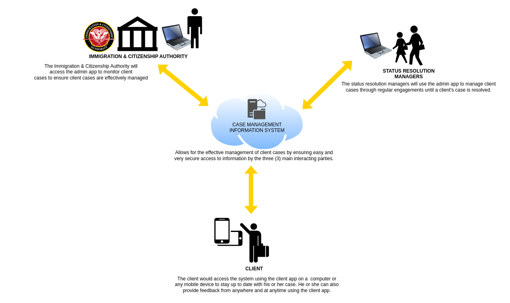

```diff
╭━━━┳━╮╱╭┳━━━╮╭━━━╮╱╱╱╱╱╱╱╱╱╭━╮╭━╮╱╱╱╱╱╱╱╱╱╱╱╱╱╱╱╱╱╱╱╱╱╱╱╭╮╱╭━━╮╱╱╭━╮╱╱╱╱╱╱╱╱╱╱╭╮╱╱╱╱╱╱╱╱╭━━━╮╱╱╱╱╱╱╭╮
┃╭━╮┃┃╰╮┃┃╭━╮┃┃╭━╮┃╱╱╱╱╱╱╱╱╱┃┃╰╯┃┃╱╱╱╱╱╱╱╱╱╱╱╱╱╱╱╱╱╱╱╱╱╱╭╯╰╮╰┫┣╯╱╱┃╭╯╱╱╱╱╱╱╱╱╱╭╯╰╮╱╱╱╱╱╱╱┃╭━╮┃╱╱╱╱╱╭╯╰╮
┃╰━╯┃╭╮╰╯┃┃╱╰╯┃┃╱╰╋━━┳━━┳━━╮┃╭╮╭╮┣━━┳━╮╭━━┳━━┳━━┳╮╭┳━━┳━╋╮╭╯╱┃┃╭━┳╯╰┳━━┳━┳╮╭┳━┻╮╭╋┳━━┳━╮╱┃╰━━┳╮╱╭┳━┻╮╭╋━━┳╮╭╮
┃╭━━┫┃╰╮┃┃┃╭━╮┃┃╱╭┫╭╮┃━━┫┃━┫┃┃┃┃┃┃╭╮┃╭╮┫╭╮┃╭╮┃┃━┫╰╯┃┃━┫╭╮┫┃╱╱┃┃┃╭╋╮╭┫╭╮┃╭┫╰╯┃╭╮┃┃┣┫╭╮┃╭╮╮╰━━╮┃┃╱┃┃━━┫┃┃┃━┫╰╯┃
┃┃╱╱┃┃╱┃┃┃╰┻━┃┃╰━╯┃╭╮┣━━┃┃━┫┃┃┃┃┃┃╭╮┃┃┃┃╭╮┃╰╯┃┃━┫┃┃┃┃━┫┃┃┃╰╮╭┫┣┫┃┃┃┃┃╰╯┃┃┃┃┃┃╭╮┃╰┫┃╰╯┃┃┃┃┃╰━╯┃╰━╯┣━━┃╰┫┃━┫┃┃┃
╰╯╱╱╰╯╱╰━┻━━━╯╰━━━┻╯╰┻━━┻━━╯╰╯╰╯╰┻╯╰┻╯╰┻╯╰┻━╮┣━━┻┻┻┻━━┻╯╰┻━╯╰━━┻╯╰┻╯╰━━┻╯╰┻┻┻╯╰┻━┻┻━━┻╯╰╯╰━━━┻━╮╭┻━━┻━┻━━┻┻┻╯
╱╱╱╱╱╱╱╱╱╱╱╱╱╱╱╱╱╱╱╱╱╱╱╱╱╱╱╱╱╱╱╱╱╱╱╱╱╱╱╱╱╱╭━╯┃╱╱╱╱╱╱╱╱╱╱╱╱╱╱╱╱╱╱╱╱╱╱╱╱╱╱╱╱╱╱╱╱╱╱╱╱╱╱╱╱╱╱╱╱╱╱╱╭━╯┃
╱╱╱╱╱╱╱╱╱╱╱╱╱╱╱╱╱╱╱╱╱╱╱╱╱╱╱╱╱╱╱╱╱╱╱╱╱╱╱╱╱╱╰━━╯╱╱╱╱╱╱╱╱╱╱╱╱╱╱╱╱╱╱╱╱╱╱╱╱╱╱╱╱╱╱╱╱╱╱╱╱╱╱╱╱╱╱╱╱╱╱╱╰━━╯
```
---

Welcome to the Cloudcode PNG Case Management Information System, a sophisticated application built using Java Spring Boot for the backend and React for the frontend which was architected and developed by Cloudcode PNG Limited. This system is designed as a microservices architecture to handle different facets of case management efficiently.

The system is currently used by the PNG Immigration & Citizenship Authority (ICA) to manage PNG Asylum seekers (clients).

## System Components

This application comprises two primary microservices:

- **Client Web App**: A self-service application accessible only by Clients. It offers read-only information and a feedback submission feature to communicate with System Admins and Status Resolution Managers.

- **Admin Web App**: Used by System Admins, Status Resolution Managers, and ICA for administrative purposes.
  
<p align="center">
  
</p>
  

## User Manual

<a href="./cloudcode-cmis-documentation/Case%20Management%20Information%20System%20User%20Manual%20-%20V1.0.pdf" target="_blank">
    
</a>


## Technical Architecture

The system is built on the following technical stack:

- **Database**: MariaDB
- **Authentication**: Keycloak IAS 11 or greater
- **Backend**: Java with OpenJDK 17, Spring Boot 3.1.2, and Maven for builds
- **Model Layer**: Interacts with the database through a JDBC Data Access Layer
- **API**: RESTful services acting as a resource server

## Getting Started

Follow these steps to set up the project locally:

1. **Clone the repository:**

```bash
git clone https://github.com/sutherlandnele/png-case-management-information-system.git
```
2. **Set up Keycloak:**
   
- Pull Keycloak from Docker Hub and run it as a container.
  
```bash
docker pull jboss/keycloak
docker run -p 8080:8080 jboss/keycloak
```

3. **Prepare your development environment:**
- Use NetBeans or IntelliJ IDEA as your IDE.
- Install MariaDB, and import the SQL file provided to set up the database.
- Update the `application.properties` files in each service to ensure proper database connections.

## Contribution

If you find this repository useful, please consider giving it a star on GitHub. Your support is much appreciated!

## License

This project is open-sourced under the GNU General Public License v3.0. See the [LICENSE.md](LICENSE.md) file for more details.

---

<div align="center">

### 𝚂𝚑𝚘𝚠 𝚜𝚘𝚖𝚎 ❤️ 𝚋𝚢 𝚜𝚝𝚊𝚛𝚛𝚒𝚗𝚐 this repository!

</div>

